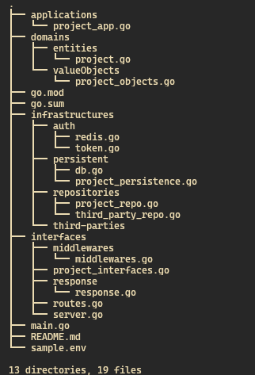

# Domain Driven Design Template Repo

### ❕❕ This is a basic DDD project structure... you should modify it to you need

### PROJECT STRUCTURE



## Project Naming

- change the file name from the sample project name to valid name
- you can create new directory as demanded
- I named them randomly and you should change the naming to your project need (ambiquios namin convention)

## command to run :

- ```
    go mod init github.com/[github username]/[project name]
  ```
- ```
    go mod tidy
  ```

⚠️ ❗ This should be modified on
